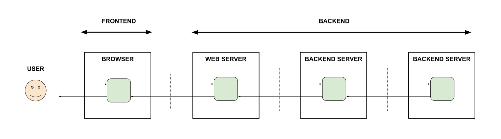

# MY FRONTEND AND BACKEND API EXAMPLES

_A place to keep my frontend and backend API examples._

Table of Contents

* [OVERVIEW](https://github.com/JeffDeCola/my-frontend-and-backend-api-examples#overview)
* [BROWSER AS A CLIENT](https://github.com/JeffDeCola/my-frontend-and-backend-api-examples#browser-as-a-client)
* [WEB SERVER AS A CLIENT](https://github.com/JeffDeCola/my-frontend-and-backend-api-examples#web-server-as-a-client)
* [BACKEND SERVER AS A CLIENT](https://github.com/JeffDeCola/my-frontend-and-backend-api-examples#backend-server-as-a-client)
* [MULTI-HOP EXAMPLES](https://github.com/JeffDeCola/my-frontend-and-backend-api-examples#multi-hop-examples)

Documentation and Reference

* [offsite demos](http://www.jeffdecola.com/my-frontend-and-backend-api-examples/index.php)
* This repos
  [github webpage](https://jeffdecola.github.io/my-frontend-and-backend-api-examples/)
  _built with
  [concourse](https://github.com/JeffDeCola/my-frontend-and-backend-api-examples/blob/master/ci-README.md)_

## OVERVIEW

The **frontend** usually consists of a browser.
The **backend** may consist of a web server and/or a backend server(s).
Lets figure out how they can talk with each other.

## BROWSER AS A CLIENT

* [get-data-from-web-server-to-browser-using-ajax-xhr-get-call](https://github.com/JeffDeCola/my-frontend-and-backend-api-examples/tree/main/my-frontend-and-backend-api-examples/browser-as-a-client/get-data-from-web-server-to-browser-using-ajax-xhr-get-call)

  _**Get data**
  from a Web Server
  to a Browser
  (using an **Ajax XMLHttpRequest (XHR) GET Call**)._

* [send-data-from-browser-to-web-server-using-ajax-xhr-post-call](https://github.com/JeffDeCola/my-frontend-and-backend-api-examples/tree/main/my-frontend-and-backend-api-examples/browser-as-a-client/send-data-from-browser-to-web-server-using-ajax-xhr-post-call)

  _**Send data**
  from a Browser
  to a Web Server
  (using an **Ajax XMLHttpRequest (XHR) POST Call**)._

## WEB SERVER AS A CLIENT

* [get-data-from-backend-server-to-web-server-using-grpc-with-protobuf](https://github.com/JeffDeCola/my-frontend-and-backend-api-examples/tree/main/my-frontend-and-backend-api-examples/web-server-as-a-client/get-data-from-backend-server-to-web-server-using-grpc-with-protobuf)

  _**Get data**
  from a Backend Server
  to a Web Server
  (using **gRPC with protobuf**)._

* [send-data-from-web-server-to-backend-server-using-grpc-with-protobuf](https://github.com/JeffDeCola/my-frontend-and-backend-api-examples/tree/main/my-frontend-and-backend-api-examples/web-server-as-a-client/send-data-from-web-server-to-backend-server-using-grpc-with-protobuf)

  _**Send data**
  from a Web Server
  to a Backend Server
  (using an **gRPC with protobuf)**._

## BACKEND SERVER AS A CLIENT

* [get-data-from-backend-server-to-backend-server-using-grpc-with-protobuf](https://github.com/JeffDeCola/my-frontend-and-backend-api-examples/tree/main/my-frontend-and-backend-api-examples/backend-server-as-a-client/get-data-from-backend-server-to-backend-server-using-grpc-with-protobuf)

  _**Get data**
  from a Backend Server
  to a Backend Server
  (using **gRPC with protobuf)**._

* [get-data-from-web-server-to-backend-server-using-grpc-with-protobuf](https://github.com/JeffDeCola/my-frontend-and-backend-api-examples/tree/main/my-frontend-and-backend-api-examples/backend-server-as-a-client/get-data-from-web-server-to-backend-server-using-grpc-with-protobuf)

  _**Get data**
  from a Web Server
  to a Backend Server
  (using **gRPC with protobuf)**._

* [send-data-from-backend-server-to-backend-server-using-grpc-with-protobuf](https://github.com/JeffDeCola/my-frontend-and-backend-api-examples/tree/main/my-frontend-and-backend-api-examples/backend-server-as-a-client/send-data-from-backend-server-to-backend-server-using-grpc-with-protobuf)

  _**Send data**
  from a Backend Server
  to a Backend Server
  (using **gRPC with protobuf)**._

* [send-data-from-backend-server-to-web-server-using-grpc-with-protobuf](https://github.com/JeffDeCola/my-frontend-and-backend-api-examples/tree/main/my-frontend-and-backend-api-examples/backend-server-as-a-client/send-data-from-backend-server-to-web-server-using-grpc-with-protobuf)

  _**Send data**
  from a Backend Server
  to a Web Server
  (using **gRPC with protobuf)**._

## MULTI-HOP EXAMPLES

* [send-data-from-browser-to-web-server-to-backend-server](https://github.com/JeffDeCola/my-frontend-and-backend-api-examples/tree/main/my-frontend-and-backend-api-examples/multi-hop-examples/send-data-from-browser-to-web-server-to-backend-server)

  _**Send data**
  from a Browser
  to a Web Server
  (using an **Ajax XMLHttpRequest (XHR) POST Call)**
  to a Backend Server
  (using **gRPC with protobuf)**._
