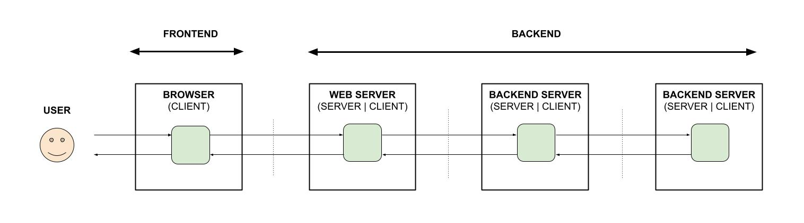

# my-frontend-and-backend-api-examples

_A place to keep my frontend and backend API examples._

Table of Contents,

* [FRONTEND AND BACKEND API EXAMPLES](https://github.com/JeffDeCola/my-frontend-and-backend-api-examples#frontend-and-backend-api-examples)
* [BROWSER AS A CLIENT](https://github.com/JeffDeCola/my-frontend-and-backend-api-examples#browser-as-a-client)
* [WEB SERVER AS A CLIENT](https://github.com/JeffDeCola/my-frontend-and-backend-api-examples#web-server-as-a-client)
* [BACKEND SERVER AS A CLIENT](https://github.com/JeffDeCola/my-frontend-and-backend-api-examples#backend-server-as-a-client)

Documentation and reference,

* [See offsite demos](http://www.jeffdecola.com/my-frontend-and-backend-api-examples/index.php)

[GitHub Webpage](https://jeffdecola.github.io/my-frontend-and-backend-api-examples/)
_built with
[concourse ci](https://github.com/JeffDeCola/my-frontend-and-backend-api-examples/blob/master/ci-README.md)_

## FRONTEND AND BACKEND API EXAMPLES

The **frontend** usually consists of a browser.
The **backend** may consist of a web server and/or a backend server(s).
Lets figure out how they can talk with each other.

## BROWSER AS A CLIENT

* [get-data-from-web-server-to-browser-using-ajax-xhr-get-call](https://github.com/JeffDeCola/my-frontend-and-backend-api-examples/tree/main/my-frontend-and-backend-api-examples/browser-as-a-client/get-data-from-web-server-to-browser-using-ajax-xhr-get-call)

  _**Get data**
  from a Web Server
  using an **Ajax XMLHttpRequest (XHR) GET Call**._

* [send-data-from-browser-to-web-server-using-ajax-xhr-post-call](https://github.com/JeffDeCola/my-frontend-and-backend-api-examples/tree/main/my-frontend-and-backend-api-examples/browser-as-a-client/send-data-from-browser-to-web-server-using-ajax-xhr-post-call)

  _**Send data**
  to a Web Server
  using an **Ajax XMLHttpRequest (XHR) POST Call**._

## WEB SERVER AS A CLIENT

* [get-data-from-backend-server-to-web-server-using-grpc-with-protobuf](https://github.com/JeffDeCola/my-frontend-and-backend-api-examples/tree/main/my-frontend-and-backend-api-examples/web-server-as-a-client/get-data-from-backend-server-to-web-server-using-grpc-with-protobuf)

  _**Get data**
  from a Backend Server
  using **gRPC with protobuf**._

* [send-data-from-web-server-to-backend-server-using-grpc-with-protobuf](https://github.com/JeffDeCola/my-frontend-and-backend-api-examples/tree/main/my-frontend-and-backend-api-examples/web-server-as-a-client/send-data-from-web-server-to-backend-server-using-grpc-with-protobuf)

  _**Send data**
  to a Backend Server
  using **gRPC with protobuf**._

## BACKEND SERVER AS A CLIENT

* [get-data-from-backend-server-to-backend-server-using-grpc-with-protobuf](https://github.com/JeffDeCola/my-frontend-and-backend-api-examples/tree/main/my-frontend-and-backend-api-examples/backend-server-as-a-client/get-data-from-backend-server-to-backend-server-using-grpc-with-protobuf)

  _**Get data**
  from a Backend Server
  using **gRPC with protobuf**._

* [get-data-from-web-server-to-backend-server-using-grpc-with-protobuf](https://github.com/JeffDeCola/my-frontend-and-backend-api-examples/tree/main/my-frontend-and-backend-api-examples/backend-server-as-a-client/get-data-from-web-server-to-backend-server-using-grpc-with-protobuf)

  _**Get data**
  from a Web Server
  using **gRPC with protobuf**._

* [send-data-from-backend-server-to-backend-server-using-grpc-with-protobuf](https://github.com/JeffDeCola/my-frontend-and-backend-api-examples/tree/main/my-frontend-and-backend-api-examples/backend-server-as-a-client/send-data-from-backend-server-to-backend-server-using-grpc-with-protobuf)

  _**Send data**
  to a Backend Server
  using **gRPC with protobuf**._

* [send-data-from-backend-server-to-web-server-using-grpc-with-protobuf](https://github.com/JeffDeCola/my-frontend-and-backend-api-examples/tree/main/my-frontend-and-backend-api-examples/backend-server-as-a-client/send-data-from-backend-server-to-web-server-using-grpc-with-protobuf)

  _**Send data**
  to a Web Server
  using **gRPC with protobuf**._

## MULTI-HOP EXAMPLES

* [send-data-from-browser-to-web-server-to-backend-server](https://github.com/JeffDeCola/my-frontend-and-backend-api-examples/tree/main/my-frontend-and-backend-api-examples/multi-hop-examples/send-data-from-browser-to-web-server-to-backend-server)

  _**Send data**
  to a Web Server
  using an **Ajax XMLHttpRequest (XHR) POST Call**
  to a Backend Server
  using **gRPC with protobuf**._
