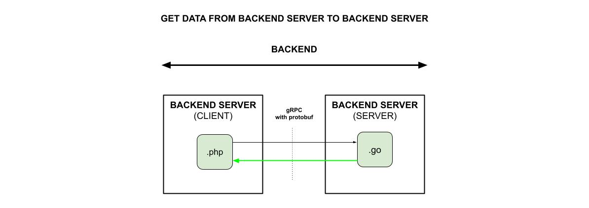

# GET DATA FROM A BACKEND SERVER USING gRPC WITH PROTOBUF

_**Get data**
from a Backend Server
to a Backend Server
using **gRPC with protobuf**._

[See offsite demo](http://www.jeffdecola.com/my-frontend-and-backend-api-examples/index.php?page=get-data-from-backend-server-to-backend-server-using-grpc-with-protobuf)

## OVERVIEW

## CODE

tbd

### CLIENT SIDE

tbd

### SERVER SIDE

tbd
