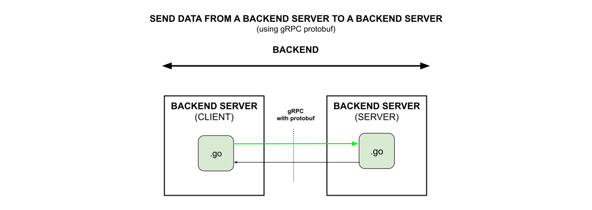

# SEND DATA FROM A BACKEND SERVER TO A BACKEND SERVER (using gRPC with protobuf)

_**Send data**
from a Backend Server
to a Backend Server
(using **gRPC with protobuf)**._

* [OVERVIEW](https://github.com/JeffDeCola/my-frontend-and-backend-api-examples/tree/main/my-frontend-and-backend-api-examples/backend-server-as-a-client/send-data-from-backend-server-to-backend-server-using-grpc-with-protobuf#overview)
* [CODE](https://github.com/JeffDeCola/my-frontend-and-backend-api-examples/tree/main/my-frontend-and-backend-api-examples/backend-server-as-a-client/send-data-from-backend-server-to-backend-server-using-grpc-with-protobuf#code)
  * [CLIENT SIDE](https://github.com/JeffDeCola/my-frontend-and-backend-api-examples/tree/main/my-frontend-and-backend-api-examples/backend-server-as-a-client/send-data-from-backend-server-to-backend-server-using-grpc-with-protobuf#client-side)
  * [SERVER SIDE](https://github.com/JeffDeCola/my-frontend-and-backend-api-examples/tree/main/my-frontend-and-backend-api-examples/backend-server-as-a-client/send-data-from-backend-server-to-backend-server-using-grpc-with-protobuf#server-side)

Documentation and Reference

* [offsite demo](http://www.jeffdecola.com/my-frontend-and-backend-api-examples/index.php?page=send-data-from-backend-server-to-backend-server-using-grpc-with-protobuf)

## OVERVIEW

## CODE

tbd

### CLIENT SIDE

tbd

### SERVER SIDE

tbd
