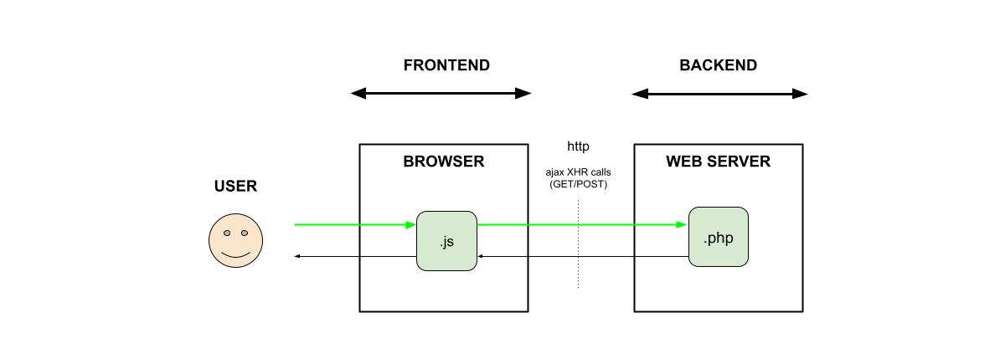

# GET DATA USING AN XMLHttpRequest (XHR) GET CALL

_Get data from a Web Server to a Browser.
The API will use an **Ajax XMLHttpRequest (XHR) GET call**
written in javascript and php._
  
[See offsite demo](http://www.jeffdecola.com/my-frontend-and-backend-api-examples/index.php?page=ajax-XHR-calls-browser-to-web-server)

## XMLHttpRequest

XMLHttpRequest (XHR) is a JavaScript API to create AJAX requests.
The request sent by XMLHttpRequest can either be a GET or POST.
Its methods provide the ability to send network requests between a
browser and a server.



## CODE

A request will be
sent from a browser (client)
to a web server (server)
that will return the current time.
A webpage will be used to
display this time.

### GET DATA USING XMLHttpRequest (XHR) GET CALL

Call this javascript every time you want to get data from the server,

```js
function get_data_from_web_server() {

    // CREATE A NEW REQUEST
    getRequest = new XMLHttpRequest();
        if (!getRequest) {
        console.warn("Giving up :( Cannot create an XMLHTTP instance");
    }
    
    // OPEN CONNECTION - CREATE GET REQUEST
    // true means DON'T BLOCK
    getRequest.open('GET', url, true);

    // SEND JSON FORMAT
    getRequest.setRequestHeader('Content-Type', 'application/json');
    getRequest.send();

    // LISTEN AND KICK OFF FUNCTION WHEN READY
    getRequest.onreadystatechange = function() {

        // CHECK IF IT'S DONE
        try {
            if (getRequest.readyState === XMLHttpRequest.DONE) {

                if (getRequest.status === 200) {

                    // THE MAGIC HAPPENS HERE *******************************************
                    // RECEIVE JSON FORMAT
                    serverData = JSON.parse(getRequest.responseText);
                    show_data(serverData.data);

                } else {
                    console.warn("There was an issue getting data to the server");
                    serverError = true;
                }
            }
        }
        // WHEN THE SERVER IS DOWN
        catch( e ) {
            console.warn("There was an issue getting data to the server: Caught Server Exception:" + e.description);
            serverError = true;
            server_error();
        }

    }
}
```

### SEND DATA FROM THE WEB SERVER

```php
// DO SOMETHING
$hour = date("h");
$minute = date("i");
$second = date("s");

// BUILD ARRAY
$dataArray = [
    'hour'=>$hour,
    'minute'=>$minute,
    'second'=>$second,
];

// SEND IT TO THE BROWSER
echo json_encode($dataArray);
```
