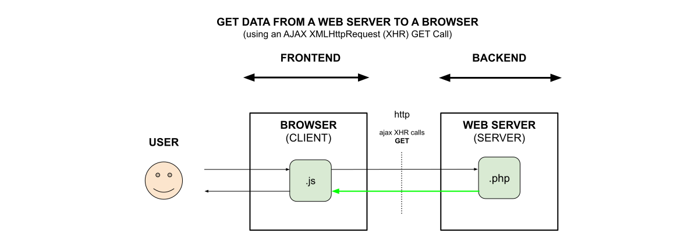

# GET DATA FROM A WEB SERVER TO A BROWSER (using an AJAX XMLHttpRequest (XHR) GET call)

[](https://jeffdecola.com)
[](https://jeffdecola.mit-license.org)

_**Get data**
from a Web Server
to a Browser
(using an **Ajax XMLHttpRequest (XHR) GET Call**)._

Table of Contents

* [XMLHttpRequest](https://github.com/JeffDeCola/my-frontend-and-backend-api-examples/tree/main/my-frontend-and-backend-api-examples/browser-as-a-client/get-data-from-web-server-to-browser-using-ajax-xhr-get-call#xmlhttprequest)
* [CODE](https://github.com/JeffDeCola/my-frontend-and-backend-api-examples/tree/main/my-frontend-and-backend-api-examples/browser-as-a-client/get-data-from-web-server-to-browser-using-ajax-xhr-get-call#code)
  * [CLIENT SIDE](https://github.com/JeffDeCola/my-frontend-and-backend-api-examples/tree/main/my-frontend-and-backend-api-examples/browser-as-a-client/get-data-from-web-server-to-browser-using-ajax-xhr-get-call#client-side)
  * [SERVER SIDE](https://github.com/JeffDeCola/my-frontend-and-backend-api-examples/tree/main/my-frontend-and-backend-api-examples/browser-as-a-client/get-data-from-web-server-to-browser-using-ajax-xhr-get-call#server-side)

Documentation and Reference

* [offsite demo](http://www.jeffdecola.com/my-frontend-and-backend-api-examples/index.php?page=get-data-from-web-server-to-browser-using-ajax-xhr-get-call)

## XMLHttpRequest

XMLHttpRequest (XHR) is a JavaScript API to create AJAX requests.
The request sent by XMLHttpRequest can either be a GET or POST.
Its methods provide the ability to send network requests between a
browser and a server.



## CODE

A request will be
sent from a browser (client)
to a web server (server)
that will return the current time.
A webpage will be used
to display the result.

### CLIENT SIDE

Call this javascript function every time you want to get data from the web server.
This will get data using an XMLHttpRequest (XHR) GET call.

```js
// MAIN PARTS OF THE CODE
function get_data_from_web_server() {

        // PHP FILE LOCATION
        var url = 'path to file/filename.php';

        // CREATE A NEW REQUEST
        getRequest = new XMLHttpRequest();

        // OPEN CONNECTION - CREATE GET REQUEST
        getRequest.open  'GET' , url, true);

        // SEND JSON FORMAT
        getRequest.setRequestHeader('Content-Type', 'application/json');
        getRequest.send();

        // LISTEN AND KICK OFF FUNCTION WHEN READY
        getRequest.onreadystatechange = function() {
            ...see code...
        }
    ...
}
```

### SERVER SIDE

This php code sends data from the web server.

```php
// DO SOMETHING
$hour = date("h");
$minute = date("i");
$second = date("s");

// BUILD ARRAY
$dataArray = [
    'hour'=>$hour,
    'minute'=>$minute,
    'second'=>$second,
];

// SEND IT TO THE BROWSER
echo json_encode($dataArray);
```
