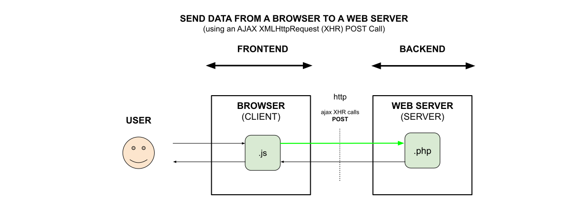

# SEND DATA FROM A BROWSER TO TO A WEB SERVER (using an AJAX XMLHttpRequest (XHR) POST call)

[](https://jeffdecola.com)
[](https://jeffdecola.mit-license.org)

_**Send data**
from a Browser
to a Web Server
(using an **Ajax XMLHttpRequest (XHR) POST Call**)._

Table of Contents

* [XMLHttpRequest](https://github.com/JeffDeCola/my-frontend-and-backend-api-examples/tree/main/my-frontend-and-backend-api-examples/browser-as-a-client/send-data-from-browser-to-web-server-using-ajax-xhr-post-call#xmlhttprequest)
* [CODE](https://github.com/JeffDeCola/my-frontend-and-backend-api-examples/tree/main/my-frontend-and-backend-api-examples/browser-as-a-client/send-data-from-browser-to-web-server-using-ajax-xhr-post-call#code)
  * [CLIENT SIDE](https://github.com/JeffDeCola/my-frontend-and-backend-api-examples/tree/main/my-frontend-and-backend-api-examples/browser-as-a-client/send-data-from-browser-to-web-server-using-ajax-xhr-post-call#client-side)
  * [SERVER SIDE](https://github.com/JeffDeCola/my-frontend-and-backend-api-examples/tree/main/my-frontend-and-backend-api-examples/browser-as-a-client/send-data-from-browser-to-web-server-using-ajax-xhr-post-call#server-side)

Documentation and Reference

* [offsite demo](http://www.jeffdecola.com/my-frontend-and-backend-api-examples/index.php?page=send-data-from-browser-to-web-server-using-ajax-xhr-post-call)

## XMLHttpRequest

XMLHttpRequest (XHR) is a JavaScript API to create AJAX requests.
The request sent by XMLHttpRequest can either be a GET or POST.
Its methods provide the ability to send network requests between a
browser and a server.



## CODE

Two numbers will be
sent from a browser (client)
to a web server (server)
that will calculate
and return the sum.
A webpage will be used to
enter the data and
display the roundtrip result.

### CLIENT SIDE

This javascript gets user input.

Javascript,

```js
// MAIN PARTS OF THE CODE

// GATHER ALL OPERANDS FROM INPUT
operand1 = document.getElementById('operand_1_input_field').value;
operand2 = document.getElementById('operand_2_input_field').value;

// SEND DATA TO SERVER
send_data_to_web_server(operand1, operand2);
```

Call this javascript function every time you want to send data to the web server.
This will send data using an XMLHttpRequest (XHR) POST call.

```js
// MAIN PARTS OF THE CODE
function send_data_to_web_server(operand1, operand2) {

        // PHP FILE LOCATION
        var url = 'path to file/filename.php';

        // CREATE A NEW REQUEST
        postRequest = new XMLHttpRequest();

        // CONVERT JSON TO STRING
        var attributesJSONString = JSON.stringify({
            "operand1": operand1,
            "operand2": operand2
        });

        // OPEN CONNECTION - CREATE POST REQUEST
        postRequest.open  'POST' , url, true);

        // SEND JSON FORMAT
        postRequest.setRequestHeader('Content-Type', 'application/json');
        postRequest.send(attributesJSONString);

        // LISTEN AND KICK OFF FUNCTION WHEN READY
        postRequest.onreadystatechange = function() {
            ...see code...
        }
    ...
}
```

### SERVER SIDE

This php code receives data from the web server and responds.

```php
// GET THE JSON DATA FROM THE USER
header("Content-Type: application/json");
$attributesJSON = json_decode(file_get_contents("php://input"));

// UN PARSE IT
$operand1 = $attributesJSON->operand1;
$operand2 = $attributesJSON->operand2;

// DO SOMETHING
$sum = (float)$operand1 + (float)$operand2;
sleep(1);

// BUILD ARRAY
$array = [
    'sum'=>$sum
];

// SEND IT TO THE BROWSER
echo json_encode($array);
```
