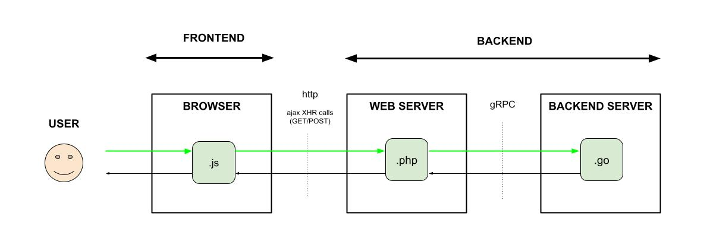

# SEND DATA USING AN XMLHttpRequest (XHR) POST CALL

_Send data from a Browser to a Web Server to a Backend Server.
The API will use an **Ajax XMLHttpRequest (XHR) POST call**
written in javascript and php and
**gRPC with protobuf**
written in php and go._
  
[See offsite demo](http://www.jeffdecola.com/my-frontend-and-backend-api-examples/index.php?page=ajax-XHR-calls-and-gRPC-with-protobuf)

## OVERVIEW

## CODE

Two numbers will be
sent from a browser (client)
to a web server (server)
to a backend server (server)
that will calculate
and return the sum.
A webpage will be used to
enter the data and
display the roundtrip results.

### GET USER DATA

tbd
