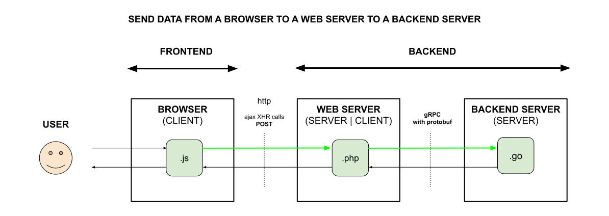

# SEND DATA FROM A BROWSER TO A WEB SERVER TO A BACKEND SERVER

_**Send data**
from a Browser
to a Web Server
(using an **Ajax XMLHttpRequest (XHR) POST Call)**
to a Backend Server
(using **gRPC with protobuf)**._

Table of Contents

* [Overview](https://github.com/JeffDeCola/my-frontend-and-backend-api-examples/tree/main/my-frontend-and-backend-api-examples/multi-hop-examples/send-data-from-browser-to-web-server-to-backend-server#overview)
* [Code](https://github.com/JeffDeCola/my-frontend-and-backend-api-examples/tree/main/my-frontend-and-backend-api-examples/multi-hop-examples/send-data-from-browser-to-web-server-to-backend-server#code)
  * [Client Side](https://github.com/JeffDeCola/my-frontend-and-backend-api-examples/tree/main/my-frontend-and-backend-api-examples/multi-hop-examples/send-data-from-browser-to-web-server-to-backend-server#client-side)
  * [Server Side](https://github.com/JeffDeCola/my-frontend-and-backend-api-examples/tree/main/my-frontend-and-backend-api-examples/multi-hop-examples/send-data-from-browser-to-web-server-to-backend-server#server-side)

Documentation and Reference

* [offsite demo](http://www.jeffdecola.com/my-frontend-and-backend-api-examples/index.php?page=send-data-from-browser-to-web-server-to-backend-server)

## OVERVIEW

## CODE

tbd

### CLIENT SIDE

tbd

### SERVER SIDE

tbd
