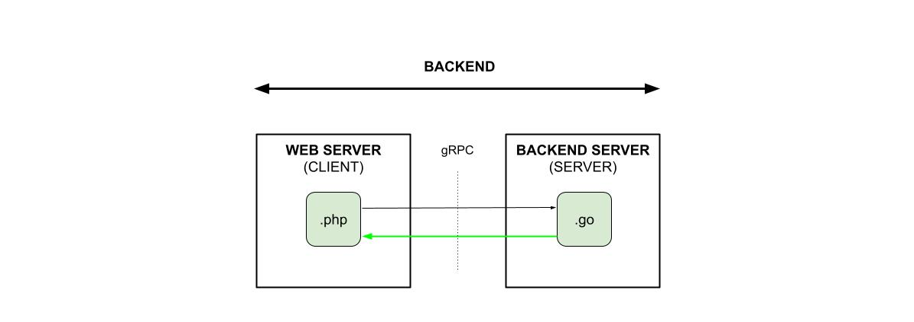

# SEND DATA USING gRPC WITH PROTOBUF

_Send data from a Web Server to a Backend Server.
The API will use an **gRPC with protobuf**
written in php and go._

[See offsite demo](http://www.jeffdecola.com/my-frontend-and-backend-api-examples/index.php?page=gRPC-with-protobuf-backend-server-to-web-server)

## gRPC WITH PROTOBUF

tbd

## CODE

Two numbers will be
sent from a web server (client)
to a backend server (server)
that will calculate
and return the sum.
A webpage will be used to
enter the data and
display the roundtrip results.

## TBD

tbd
