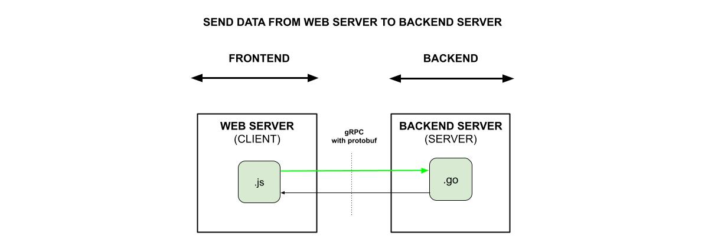

# SEND DATA TO A WEB SERVER USING AN XMLHttpRequest (XHR) POST CALL

_**Send data**
from a Web server
to a Backend Server
using an **gRPC with protobuf**._

Documentation and reference,

* The frontend uses
  [send-data-from-browser-to-web-server-using-ajax-xhr-post-call](https://github.com/JeffDeCola/my-frontend-and-backend-api-examples/tree/main/my-frontend-and-backend-api-examples/browser-as-a-client/send-data-from-browser-to-web-server-using-ajax-xhr-post-call)

[See offsite demo](http://www.jeffdecola.com/my-frontend-and-backend-api-examples/index.php?page=send-data-from-web-server-to-backend-server-using-grpc-with-protobuf)

## PROTOBUF

```protobuf
syntax = "proto3";

package main;

message Data {
    int32 operand1 = 1;
    int32 operand2 = 2;
}
```

## PROTOCOL BUFFERS (PROTOBUF) & gRPC

* **Protobuf** (Protocol Buffers)
  * Human readable platform-neutral messages
  * Shared by both the client and the server

* **gRPC** (google Remote Procedure Call)
  * A way of running a remote procedure on a remote machine

## OVERVIEW

A frontend will be attached to this example, but is not part of it.



## CODE

Two numbers will be
sent from a web server (client)
to a backend server (server)
that will calculate
and return the sum.
A webpage was added to
enter the data and
display the roundtrip result.

### PROTOBUF MESSAGE

```protobuf
syntax = "proto3";

package main;

message Data {
    int32 operand1 = 1;
    int32 operand2 = 2;
}
```

### CLIENT SIDE

tbd

### SERVER SIDE

tbd
